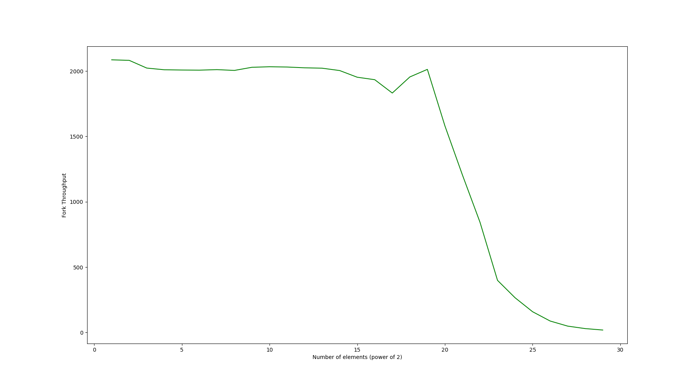
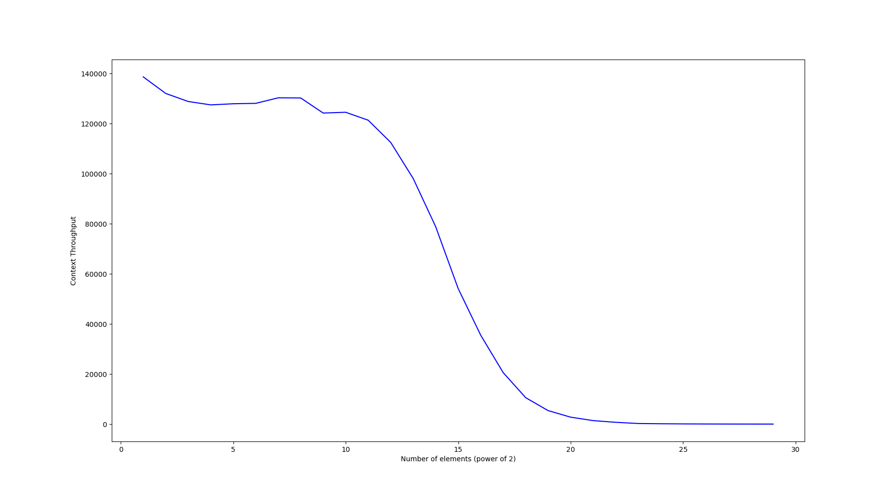
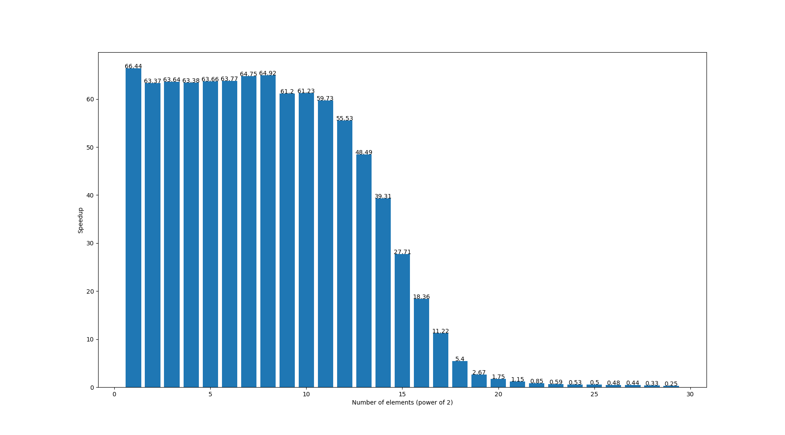

1. This patch should be applied on linux 6.0.19.
2. Testcases are run for a total of 5 times for every value of n (# of elements) to reduce measurement error. Timeout = 10 secs, Memory = 4GB.
3. We observe with increase in n (# of elements) the speedup benefits starts diminishing, as the cost of saving page-data closes to that of creating an forking the process.
4. Runs out of memory from n = 30, because running on a machine with 4GB and 2 ^ 30 (1G) * sizeof (int) (4B) = 4GB.

Fork Throughput for different program sizes :-

Context Throughput for different program sizes :-

Speedup for different program sizes :-
